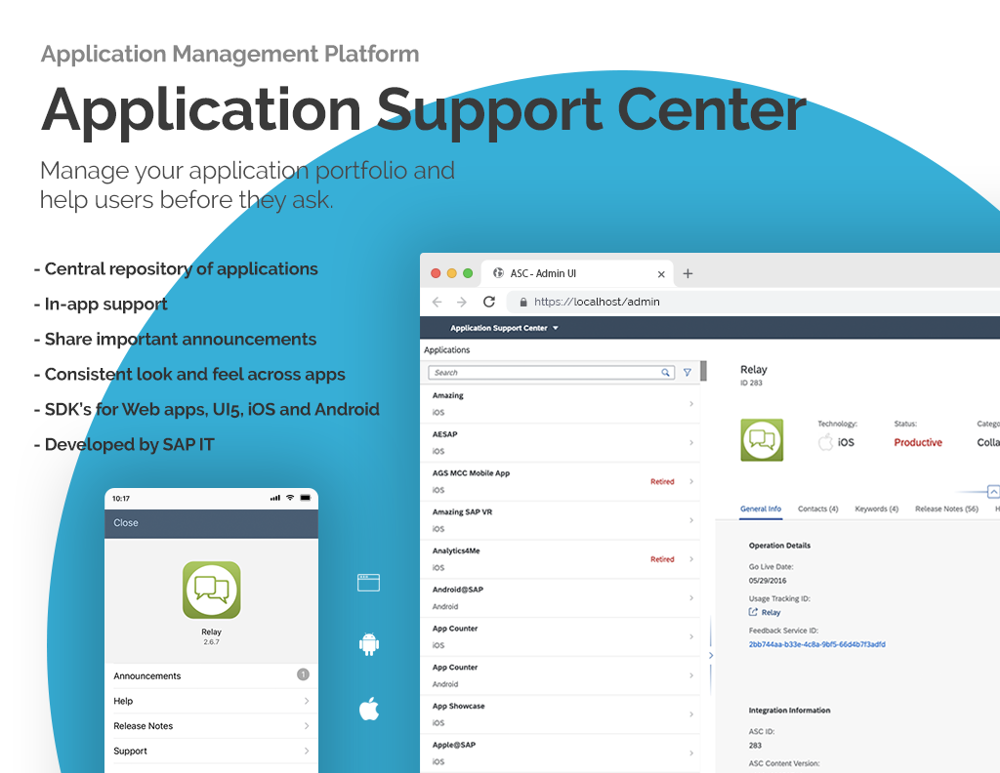
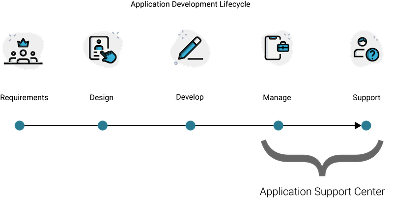

Application Support Center (ASC) is a management platform for mobile and web applications. It provides an administration portal storing application details and a central knowledge base for help, release notes, and important announcements. These knowledge articles are available in your applications through the included SDK providing in-app help and support to your end-users.

## Features

- Central application management: ASC acts as a central management portal for all of your applications. Store a list of application owners, developers, source code links, and application details in one place.
- In-app Help: ASC provides a Mobile SDK, UI5 SDK, Web SDK, Web Portal and API's sharing help, release notes, and details about each application for your end-users. This provides the opportunity for self-service before they contact support.
- Developers: ASC is simple to integrate in applications and reduces the need to recompile and deploy when help, release notes, announcements or support contacts change. Our drop-in SDK's provide content syncing and are available for Android, iOS, UI5 and HTML based applications with just a few lines of code.
- Application Owners: ASC provides a central location to store application details and the ability to update in-app support content without needing to get developers involved.
- Consistency: ASC provides a consistent look and feel across all your apps and platforms giving your users a familiar experience when it's needed.

## Components

"Core" Components included in this repo:

- Administration UI
- Server/API

- Portal UI
- ASC SAPUI5 SDK

Other Components:

- <a href="https://" target="_blank">ASC iOS SDK</a>
- <a href="https://" target="_blank">ASC Android SDK</a>

## Requirements

- <a href="https://www.nodejs.org" target="_blank">Node.js (13.x.x +)</a>
- <a href="https://www.postgresql.org" target="_blank">Postgres</a>

The Server/API uses Node.js/Express and Postgres for persistence

The Administration UI uses OpenUI5

## Wiki

Please see our wiki pages for details on local or cloud based deployment options, component overview and other details related to the project.
