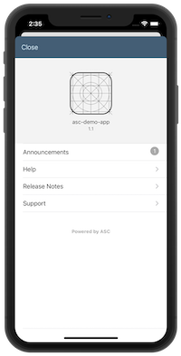

# application support center - iOS Demo App



This is a simple but complete iOS app which includes the iOS SDK to test the functionality of the iOS SDK. If configured correctly, the app will display the help pages, app contacts announcements and release notes from the admin panel.

## Components

Component included in this repo:

- asc iOS Demo App & SDK

Other Components:

- asc Core

## Installation

- Download/Fork this repo, unzip and open the project

## Usage

1. Import the SDK into your project and create a instance of the InfoCenter

```
let infoCenter = ASCInfoCenter()
```

2. Initialize the InfoCenter. This will perform a new content comparison and fetch data from the server. The appId and accessToken are displayed in the Admin UI.

```
override func viewDidLoad() {
    super.viewDidLoad()
    infoCenter.initHelp(appId: "789", serverURL: "http://localhost:5001/api/v1", accessToken: "xyz123")
}
```

3. Add a IBAction to your existing application to show the ASC InfoCenter popup.

```
@IBAction func showHelpCenter(_ sender: Any) {
    infoCenter.showHelp(in: self)
}
```

4. Optional: Run a manual check for content changes. This method will query the ASC Server to check and download any changes. This could be called on a lifecycle event such as ```applicationWillEnterForeground(_:)```

```
infoCenter.checkContentVersion()
```

5. Optional: The InfoCenter can be opened directly in one of the views if you do not want to display the main page.

```
infoCenter.showHelp(View: "Release Notes", in: self) //"Help" || "Support" || "Announcements"
```

